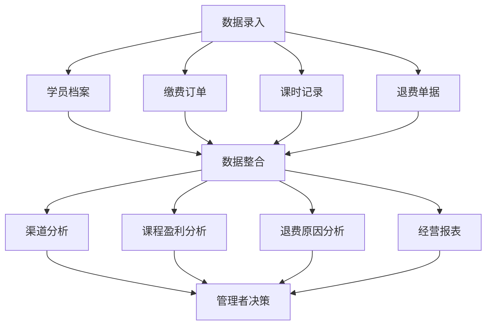

## 1. 产品概述

少儿艺术培训机构数据分析管理系统，整合学员档案、缴费订单、课时记录、退费单据四大核心数据，搭建全维度数据分析模块，帮助管理者精准核算各课程盈利情况、各招生渠道获客性价比，优化招生投放与课程运营决策。

- **目标用户**：培训机构管理者、财务人员、教务老师
- **核心价值**：数据驱动决策，降低盲目投放，关停亏损课程，优化服务质量

## 2. 核心功能

### 2.1 用户角色

| 角色 | 登录方式 | 核心权限 |
|------|----------|----------|
| 管理员 | 账号密码登录 | 全部功能访问、数据录入与编辑、报表导出、系统设置 |
| 教务老师 | 账号密码登录 | 学员管理、课时记录、查看报表 |
| 财务人员 | 账号密码登录 | 订单管理、退费管理、财务报表 |

### 2.2 功能模块

1. **数据看板首页**：核心经营指标概览、快捷操作入口
2. **学员管理**：学员档案列表、新增/编辑学员信息、学员详情页
3. **订单管理**：缴费订单列表、新增订单、订单详情
4. **课时管理**：课时消耗记录、授课记录、课时统计
5. **退费管理**：退费单据列表、新增退费、退费原因统计
6. **渠道分析**：各渠道报名人数、获客成本、续费率、投产比分析
7. **课程分析**：各课程营收、师资成本、净利润分析
8. **经营报表**：月度经营报表、寒暑假/淡旺季分析、历史数据对比

### 2.3 页面详情

| 页面名称 | 模块名称 | 功能描述 |
|----------|----------|----------|
| 数据看板 | 核心指标卡片 | 学员总数、本月营收、新增学员、课时消耗、退费金额 |
| 数据看板 | 趋势图表 | 营收趋势、学员增长趋势、课时消耗趋势 |
| 数据看板 | 快捷操作 | 新增学员、新增订单、记录课时、申请退费 |
| 学员列表 | 搜索筛选 | 按课程、渠道、状态筛选、搜索 |
| 学员列表 | 学员表格 | 姓名、年龄、课程、剩余课时、报名日期、操作 |
| 学员详情 | 基本信息 | 学员档案、联系方式、家长信息 |
| 学员详情 | 课时记录 | 历史课时消耗记录列表 |
| 学员详情 | 订单记录 | 历史缴费订单列表 |
| 学员详情 | 退费记录 | 历史退费记录列表 |
| 订单列表 | 搜索筛选 | 按课程、渠道、时间范围筛选 |
| 订单列表 | 订单表格 | 订单号、学员、课程、金额、渠道、状态、操作 |
| 课时记录 | 授课记录 | 日期、课程、老师、学员、课时数、内容 |
| 退费列表 | 退费单据 | 退费单号、学员、课程、金额、原因、状态 |
| 渠道分析 | 渠道对比卡片 | 短视频、地推、老客转介绍三大渠道核心数据 |
| 渠道分析 | 渠道详情 | 各渠道报名人数、获客成本、续费率、投产比 |
| 渠道分析 | 低效渠道标识 | 投产比过低渠道高亮提示 |
| 课程分析 | 课程盈利卡片 | 美术、舞蹈、口才三大课程核心数据 |
| 课程分析 | 盈利详情 | 单课营收、师资成本、净利润、利润率 |
| 课程分析 | 亏损课程提示 | 长期亏损冷门课程高亮提示 |
| 退费分析 | 退费原因统计 | 各类退费原因占比饼图、柱状图 |
| 退费分析 | 退费高发诱因报表 | 退费高发课程、退费高发时段、退费金额趋势 |
| 经营报表 | 月度报表 | 全机构月度经营数据汇总 |
| 经营报表 | 淡旺季分析 | 寒暑假旺季与平日淡季对比分析 |
| 经营报表 | 历史对比 | 数年数据留存与同比环比对比分析 |

## 3. 核心流程

### 3.1 学员报名流程

学员家长咨询 → 确定课程与渠道 → 创建学员档案 → 生成缴费订单 → 确认收款 → 课时到账开始上课

### 3.2 课时消耗流程

老师授课 → 记录课时消耗 → 扣减学员剩余课时 → 更新课程营收核算

### 3.3 退费流程

学员申请退费 → 审核退费原因 → 计算退费金额 → 生成退费单据 → 财务打款 → 订单完结

### 3.4 数据分析流程

数据录入（学员/订单/课时/退费） → 系统自动统计 → 多维度分析报表 → 管理者决策

## 4. 用户界面设计

### 4.1 设计风格

- **主色调**：暖橙色（#FF7A45），代表活力、艺术、温暖
- **辅助色**：深蓝色（#2D3748）稳重，薄荷绿（#48BB78）成功，珊瑚红（#F56565）警示
- **背景色**：浅灰蓝（#F7FAFC）清爽干净
- **按钮风格**：圆角8px，渐变按钮带微阴影，悬停有微动画
- **字体**：Noto Sans SC（中文），思源黑体
- **布局风格**：卡片式布局，侧边导航，顶部状态栏
- **图标风格**：线性图标，简洁现代

### 4.2 页面设计概述

| 页面名称 | 模块名称 | UI元素 |
|----------|----------|--------|
| 数据看板 | 指标卡片 | 渐变背景卡片、图标、数字动画计数动画、趋势小图 |
| 数据看板 | 图表区域 | ECharts折线图、柱状图、饼图 |
| 学员列表 | 表格 | 斑马纹表格、操作按钮、状态标签 |
| 表单弹窗 | 表单 | 输入框、下拉选择、日期选择、提交按钮 |
| 分析页面 | 数据卡片 | 大数字、图标、趋势箭头、颜色区分 |
| 分析页面 | 图表 | 多图表并排、悬浮详情 |

### 4.3 响应式

- 桌面端优先设计（1440px及以上
- 平板端自适应（768px-1440px
- 移动端适配（<768px），侧边栏折叠，表格横向滚动

### 4.4 动画与交互
- 页面加载渐入动画
- 卡片悬停微浮起效果
- 数字滚动数字变化时数字跳动动画
- 表格行悬停高亮
- 弹窗淡入淡出过渡
- 侧边栏展开收起平滑过渡
