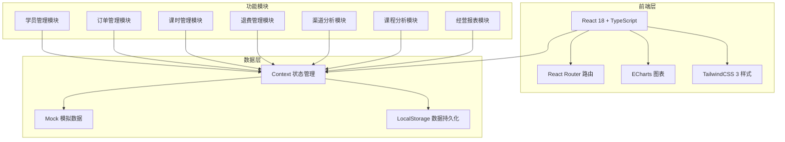
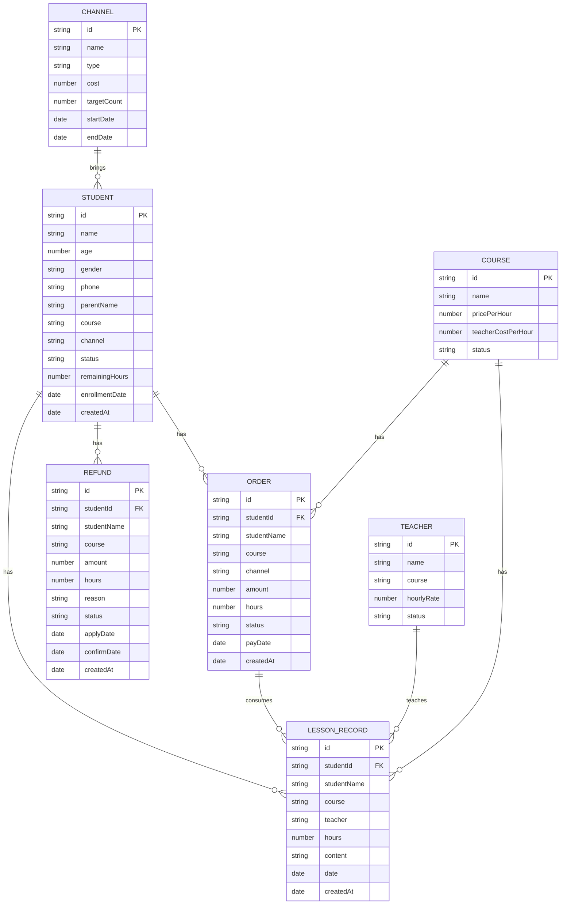

## 1. 架构设计



## 2. 技术描述

- **前端框架**：React 18 + TypeScript
- **构建工具**：Vite
- **样式方案**：TailwindCSS 3
- **路由管理**：React Router v6
- **图表库**：ECharts 5
- **图标库**：Lucide React
- **状态管理**：React Context + useReducer
- **数据存储**：Mock 数据 + LocalStorage 持久化
- **日期处理**：date-fns
- **后端**：无（纯前端应用，使用 Mock 数据）
- **数据库**：无（数据存储在 LocalStorage 中）

## 3. 路由定义

| 路由 | 页面名称 | 功能说明 |
|------|----------|----------|
| /dashboard | 数据看板 | 核心经营指标概览、趋势图表、快捷操作 |
| /students | 学员列表 | 学员档案列表、搜索筛选 |
| /students/:id | 学员详情 | 学员基本信息、课时/订单/退费记录 |
| /orders | 订单列表 | 缴费订单列表、搜索筛选 |
| /lessons | 课时记录 | 课时消耗记录、授课记录 |
| /refunds | 退费管理 | 退费单据列表、退费原因统计 |
| /channels | 渠道分析 | 渠道报名人数、获客成本、续费率、投产比 |
| /courses | 课程分析 | 课程营收、师资成本、净利润 |
| /reports | 经营报表 | 月度报表、淡旺季分析、历史对比 |

## 4. 数据模型

### 4.1 数据模型ER图



### 4.2 数据结构定义

#### 学员 (Student)
```typescript
interface Student {
  id: string;
  name: string;
  age: number;
  gender: 'male' | 'female';
  phone: string;
  parentName: string;
  course: string;
  channel: string;
  status: 'active' | 'paused' | 'finished' | 'refunded';
  remainingHours: number;
  enrollmentDate: string;
  createdAt: string;
}
```

#### 订单 (Order)
```typescript
interface Order {
  id: string;
  studentId: string;
  studentName: string;
  course: string;
  channel: string;
  amount: number;
  hours: number;
  status: 'pending' | 'paid' | 'cancelled' | 'refunded';
  payDate: string;
  createdAt: string;
}
```

#### 课时记录 (LessonRecord)
```typescript
interface LessonRecord {
  id: string;
  studentId: string;
  studentName: string;
  course: string;
  teacher: string;
  hours: number;
  content: string;
  date: string;
  createdAt: string;
}
```

#### 退费 (Refund)
```typescript
interface Refund {
  id: string;
  studentId: string;
  studentName: string;
  course: string;
  amount: number;
  hours: number;
  reason: string;
  status: 'pending' | 'approved' | 'rejected' | 'completed';
  applyDate: string;
  confirmDate?: string;
  createdAt: string;
}
```

#### 课程 (Course)
```typescript
interface Course {
  id: string;
  name: string;
  pricePerHour: number;
  teacherCostPerHour: number;
  status: 'active' | 'inactive';
}
```

#### 渠道 (Channel)
```typescript
interface Channel {
  id: string;
  name: string;
  type: 'short_video' | 'ground_promotion' | 'referral' | 'other';
  cost: number;
  targetCount: number;
  startDate: string;
  endDate: string;
}
```

#### 老师 (Teacher)
```typescript
interface Teacher {
  id: string;
  name: string;
  course: string;
  hourlyRate: number;
  status: 'active' | 'inactive';
}
```

### 4.3 初始数据

系统将包含以下模拟数据：
- 3个核心课程：美术、舞蹈、口才
- 3个招生渠道：短视频、地推、老客转介绍
- 5-8位老师
- 50-100名学员
- 100+个订单
- 500+条课时记录
- 10-20条退费记录
- 3年历史数据（用于对比分析）

## 5. 目录结构

```
src/
├── components/          # 公共组件
│   ├── Layout/         # 布局组件
│   ├── Card/           # 卡片组件
│   ├── Table/          # 表格组件
│   ├── Chart/          # 图表组件
│   ├── Modal/          # 弹窗组件
│   └── Form/           # 表单组件
├── pages/              # 页面组件
│   ├── Dashboard/      # 数据看板
│   ├── Students/       # 学员管理
│   ├── Orders/         # 订单管理
│   ├── Lessons/        # 课时管理
│   ├── Refunds/        # 退费管理
│   ├── Channels/       # 渠道分析
│   ├── Courses/        # 课程分析
│   └── Reports/        # 经营报表
├── context/            # 状态管理
│   └── DataContext.tsx
├── data/               # Mock数据
│   ├── students.ts
│   ├── orders.ts
│   ├── lessons.ts
│   ├── refunds.ts
│   ├── courses.ts
│   ├── channels.ts
│   └── teachers.ts
├── utils/              # 工具函数
│   ├── date.ts
│   ├── calculation.ts
│   └── storage.ts
├── types/              # TypeScript类型
│   └── index.ts
├── App.tsx
├── main.tsx
└── index.css
```
